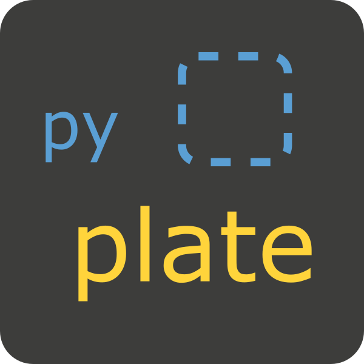

[](https://www.python.org/downloads/release/python-314/)
[](https://github.com/astral-sh/uv)
[](https://github.com/astral-sh/ruff)
[](https://github.com/astral-sh/ty)
[](https://github.com/j178/prek)
[](https://renovatebot.com/)
[](https://github.com/PyCQA/bandit)
[](https://opensource.org/licenses/MIT)


<p align="center">
  
</p>


## About the project
Template for a standard (non-framework related) python project. The point of this repo is to have a basic project layout with working CI/CD <!-- , devcontainer --> and integrated common python tools. **It should be** later on **adjusted according to the needs** of specific project.

### Integrated tools

- **[uv](https://docs.astral.sh/uv/)** (python project manager)
- **[ruff](https://docs.astral.sh/ruff/formatter/)** (formatter)
- **[ruff](https://docs.astral.sh/ruff/linter/)** (linter)
- **[ty](https://docs.astral.sh/ty/)** (type checker)
- **[bandit](https://bandit.readthedocs.io/en/latest/)** (security checks)
- **[pytest](https://docs.pytest.org/en/7.1.x/contents.html)** (unit tests)
- **[pydantic](https://docs.pydantic.dev/latest/)** (data validation, models)
- **[pydantic-settings](https://docs.pydantic.dev/latest/concepts/pydantic_settings/)** (settings management)
- **[prek](https://prek.j178.dev/)** (git hooks, running checks)
<!-- - **[devcontainer](https://code.visualstudio.com/docs/devcontainers/containers)** (development inside container) -->


## Development

<!--
TODO devcontainer
####  a) Setup with devcontainer (recommended)
This template project uses devcontainer (VS code) to setup everything. So just follow [official documentation](https://code.visualstudio.com/docs/devcontainers/tutorial) to meet prerequisites. Then open this template project in container (using VS code) and you are ready to code!

#### b) Setup without devcontainer
-->

### Requirements

- **[uv](https://docs.astral.sh/uv/getting-started/installation/)** - python project manager (*required*)
- **[make](https://www.gnu.org/software/make/manual/make.html)** - makefile, running commands (*recommended*)

### Setup

Install uv
```sh
curl -LsSf https://astral.sh/uv/install.sh | sh
```

Verify uv installation
```sh
uv --version
```

---

Copy example env file
```sh
cp -n .env.example .env
```

Create new venv and sync packages (base + dev)
```sh
uv sync
```

Activate venv
```sh
. ./.venv/bin/activate
```


### Enable Prek - pre-commit git hook
[prek](https://prek.j178.dev/) configuration is enabled for this project. To run the hooks every time you commit, install prek’s git hook integration:

```sh
prek install
```


### Check and test code

On every commit code should be static tested/checked/formatted automatically (using [pre-commit](https://pre-commit.com/) tool).

You can run static checks using
```sh
make check
```

To run unit tests use
```sh
make test
```

<!-- ## Update packages
You can manually run a script that will check for new versions of packages which are used in this project. It will update both requirements files (`base.txt`, `dev.txt`).

On top of that there is a workflow added (`packages_update.yml`) that will create new Pull Request automatically with updated packages. Cronjob for this task is set for: `0 20 * * *` (every day - 20:00). -->

## Dockerize

<!-- There are two Dockerfiles in this project.

- `.devcontainer/Dockerfile`
- `Dockerfile`

First is for developing in a devcontainer and it's also used for running stuff in the pipeline. The second is for deploying the product as shown below. You should exclude unnecessary files (such as tests) using `.dockerignore` to keep the "production ready" container as ligthweight as possible. -->

Build `image`
```sh
docker build . --tag pyplate-image
```

Create `container` and run it
```sh
docker run pyplate-image
```

You can also use provided `docker-compose`
```sh
docker compose build
docker compose up
```
